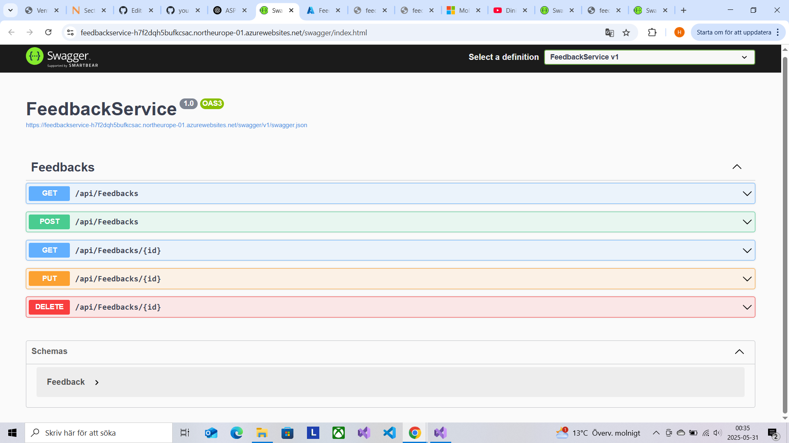
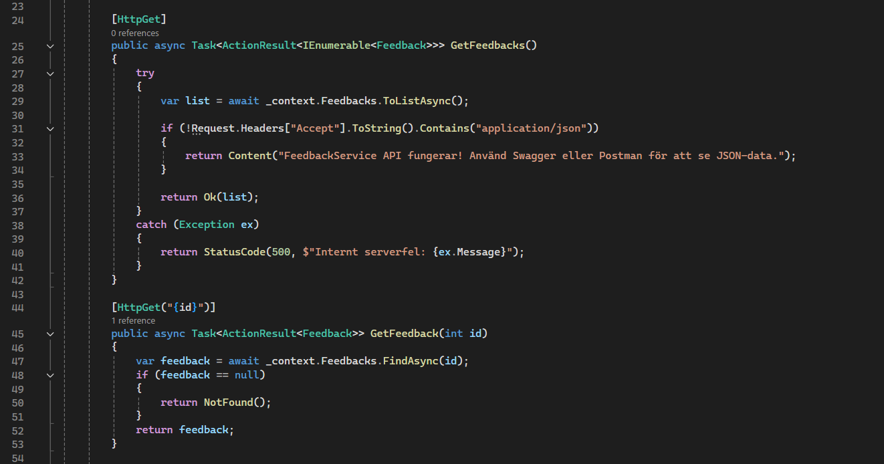
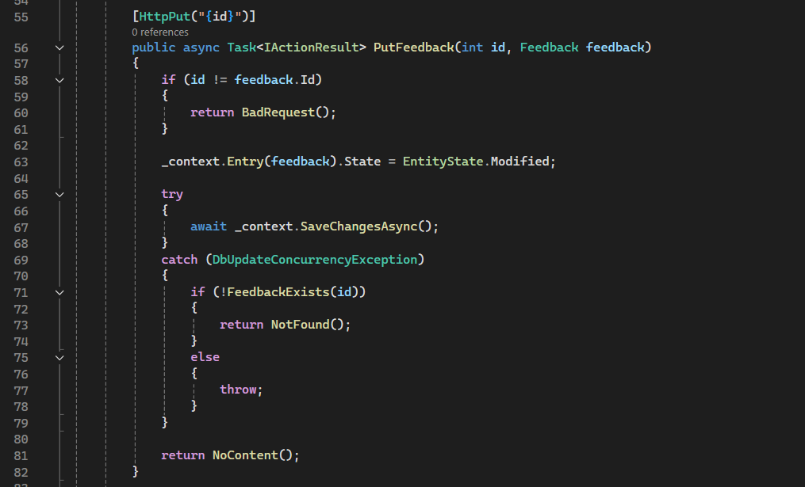
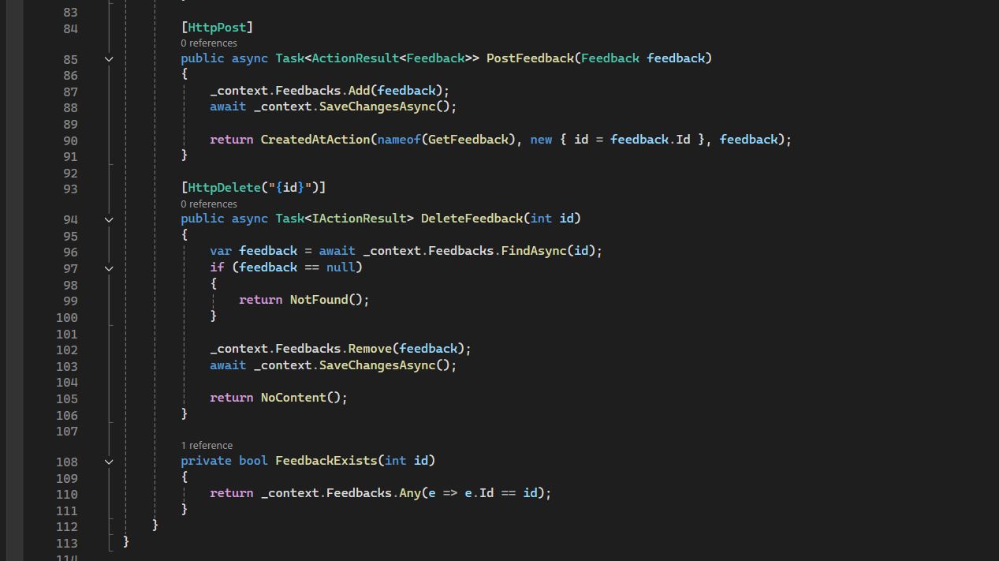

# Min individuella del

Jag har utvecklat följande del i projektet:

- **FeedbackService**: API för att hantera feedback (GET, POST, PUT, DELETE)
- **Publicerat på Azure**: [FeedbackService Swagger](https://feedbackservice-h7f2dqh5bufkcsac.northeurope-01.azurewebsites.net/swagger/index.html)
- **Kod på GitHub**: [Mitt repo på GitHub](https://github.com/Younes-nackademin/FeedbackService)

## Funktioner

- Skapa feedback (POST)
- Läsa feedback (GET)
- Uppdatera feedback (PUT)
- Ta bort feedback (DELETE)

## Tester

- Testat via **Swagger** och **publicerat på Azure**.

## Screenshots

### 1. Min Swagger-sida på Azure

### 2. Min kod i Visual Studio

**Hämta all och en specifik feedback**  

**Uppdatera feedback**  

**Skapa och ta bort feedback**  

Sammanfattning:

I detta projekt har jag utvecklat ett API, FeedbackService, med ASP.NET Core och SQLite. API:et hanterar feedback-data och är publicerat på Azure med full CRUD-funktionalitet, testad via Swagger.
