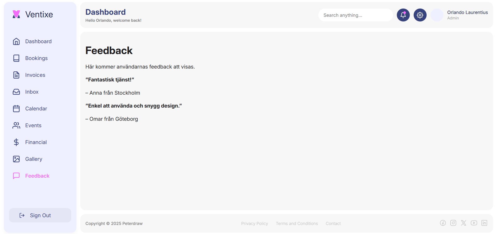

### Sammanfattning (Grupparbete)
I grupprojektet har jag ansvarat för utvecklingen av Feedback-sektionen i webbapplikationen Ventixe. På en dedikerad sida i dashboarden visas användarnas feedback, tydligt strukturerad med namn och plats. Mitt fokus har legat på att skapa en ren, lättläst design och säkerställa en sömlös integration med applikationens övriga komponenter.

### Resultat - Feedback-sidan

### Min kod för Feedback-sektionen

Här är min implementation av Feedback-komponenten i React:

